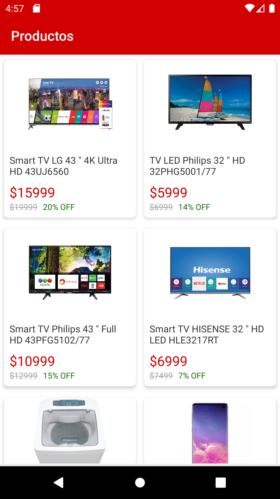

# Ecommerce-android

Es una aplicación en la que podrás visualizar un listado de productos junto a su nombre, precio, descuento, precio de lista, etc.
Además contarás con una sección de detalle con los datos anteriormente nombrados pero también una galería de imágenes y 3 reviews asociadas al producto.

Por último, cuenta con una pantalla donde podrás ver todos los reviews del producto, cantidad de opiniones hechas por los usuarios y cuantos de ellos le dieron una estrella, dos, tres, cuatro o cinco.

# Screenshots

  
  
  
  

# Detalles técnicos

Esta aplicación fue desarrollada 100% en Kotlin aplicando muchos de los patrones y arquitectura sugeridas por Google en su última I/O como por ejemplo LiveData, ViewModel, Navigation components, etc.
- Kotlin
  - Coroutines
  - Lambda expressions
  - Extension functions
  - Null-safety
  - Smart casts
  - String templates
  - Android extensions
  - Companion objects
  - Data classes
- Clean-Code
- MVVM
- SOLID
- Kodein para dependency injection
- Retrofit
- ConstraintLayout
- Android architecture components
  - LiveData
  - ViewModel
- Navigation components
- AndroidX
- Glide
- Lottie (para animaciones)
- Calligraphy
- Font, FontVariable: clases creadas para el manejo de fuentes, con la ayuda de extension functions y calligraphy.
- GSON para serialization y deserialization de JSON
- DTO pattern
- Singleton pattern
- Material Design
- Anko
- LifeCycle

